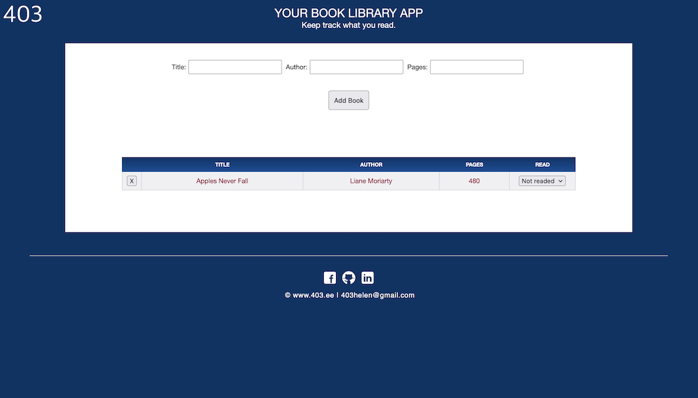

# Simple book library app

I created this to learn how to create a dynamic HTML table with JavaScript.

This was one of the projects from [The Odin Project](https://www.theodinproject.com/home) - Full Stack Curriculum.

# Created at

May 14, 2017

# Project is created with

* JavaScript
* HTML
* CSS

# View on browser

## [https://n00bg1rl.github.io/library/](https://n00bg1rl.github.io/library/)

# View as image

